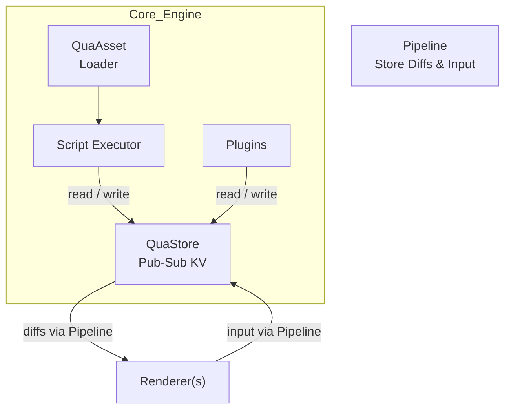

# QuaEngine – Specification & Design Document

> **Version**: 0.0.0-dev1  **Status**: Draft

---

## Table of Contents
1. [Overview](#overview)
2. [Architecture](#architecture)
3. [Data Flow](#data-flow)
4. [Core Subsystems](#core-subsystems)
5. [TypeScript API](#typescript-api)
   1. [Quick Start](#quick-start)
   2. [Script Authoring Model](#script-authoring-model)
   3. [Runtime Classes](#runtime-classes)
   4. [Helper Commands → Intents](#helper-commands--intents)
   5. [Advanced Executor Features](#advanced-executor-features)
6. [Plugin System](#plugin-system)
   1. [General Plugins](#general-plugins)
   2. [Executor Plugins](#executor-plugins)
   3. [Namespaced Store](#namespaced-store)
7. [Renderer Integration & Pipelines](#renderer-integration--pipelines)
8. [Time-Travel & Determinism](#time-travel--determinism)
9. [Extensibility Patterns](#extensibility-patterns)
10. [Event Vocabulary](#event-vocabulary)
11. [Versioning & Stability](#versioning--stability)
12. [Glossary](#glossary)

---

## Overview
QuaEngine is a **renderer-agnostic TypeScript framework** for building ADV (visual-novel) games on the web. Scripts (plain TS modules) are delivered at runtime by **QuaAsset** and executed by the Engine. The authoritative game state lives in **QuaStore**, a pub-sub key/value memory. Every subsystem listens to or mutates paths within QuaStore, yet deterministic replay and clear boundaries are preserved.

---

## Architecture
### Layers
1. **Core Engine** – deterministic, headless, and fully testable; includes state (QuaStore), asset, script, and plugin subsystems.
2. **Renderer(s)** – UI layer(s) that render sprites, text boxes, UI chrome, etc. (Canvas, WebGL, DOM, React ...).
3. **Pipeline** – bidirectional bridge ferrying store diffs and render commands between Engine and Renderer.


### Architecture Diagram



---

## Data Flow
1. Renderer writes `{ action: "ui:click", target: "next" }` to `$.uiInput` in QuaStore via Pipeline.
2. Engine observes this change, translates it into an **intent record** under `$.intents` (`intent:advance`).
3. The first **Executor Plugin** watching that intent path handles it, updates `$.state`, and writes render directives under `$.render`.
4. Pipeline streams those diffs back to the Renderer, which redraws using the latest state.

---

## Core Subsystems
### QuaStore
Key-value store persisting all mutable game state **and** acting as the sole pub-sub mechanism.
- Snapshot & revert (time-travel log)
- `watch(path, cb)` to subscribe to changes (exact or wildcard).
- TTL support for ephemeral keys (e.g. one-shot intents).

### QuaAsset
Lazy-loading asset manager (scripts, images, sprites, audio, JSON, fonts).

### Script Executor
Fetches script modules via **QuaAsset**, then executes them while maintaining a program counter. Together with QuaStore it forms a deterministic FSM.

### Plugin Manager
Registers general plugins (lifecycle hooks) and executor plugins (intent handlers) with priority ordering.

### Pipeline
Pairs one Engine with one Renderer; streams store diffs to the UI and user input back to the Engine.

---

## TypeScript API
### Quick Start
```ts
import { QuaEngine } from "@qua/core";

const engine = new QuaEngine();
await engine.boot();                 // preload assets & plugins (including scripts)
await engine.run("chapter1");       // script id fetched via QuaAsset
```

### Script Authoring Model
Scripts are plain **TypeScript modules** exporting either:
1. `async function` (default export) OR
2. `function*` / `async function*` (generator)

Both receive `ScriptContext` and can leverage full JavaScript control flow.

### Runtime Classes
- **QuaEngine** – boot, run, pause, resume, jump.
- **QuaStore** – `get / set / merge`, snapshots, history, `watch()`.
- **QuaAsset** – `script() / image() / audio() / json()`, `preload()`.

### Helper Commands → Intents
Helpers (importable via `@qua/script` **or** `ctx.*`) emit intents consumed by plugins.
| Helper          | Intent Type | Notes |
|-----------------|-------------|-------|
| `speak()`       | `speak`     | Dialogue text |
| `show()/image()`| `image`     | Show sprite/bg |
| `scene()`       | `scene`     | Clear & set BG |
| `playBGM()`     | `audio:play`| Channel `bgm` |
| `playSFX()`     | `audio:play`| Channel `sfx` |
| `hide()`        | `image:hide`| |
| `choice()`      | `choice`    | Returns value |
| `call()`        | `call`      | Sub-script |
| `label()/jump()`| `label`     | Non-returning |
| `save()/load()` | `save` / `load` | Convenience |
| `transform()`   | `transform` | ATL-like |

### Advanced Executor Features
See Ren’Py-inspired Section 10 for **scene / image**, **audio channels**, **UI screens**, **persistent scope**, **transforms**, and **save/load** APIs.

---

## Plugin System
### General Plugins
```ts
export interface QuaPlugin {
  name: string;
  setup(engine: QuaEngine, store: QuaStore): void | Promise<void>;
}
engine.use(myPlugin);
```
Used for lifecycle hooks, custom helpers, analytics, or to register additional store routers.

### Executor Plugins
Intent handlers that power all high-level game verbs.
```ts
export interface ExecutorPlugin {
  name: string;             // unique id (store namespace)
  order?: number;           // lower = higher priority (default 100)
  canHandle(intent: Intent, ctx: PluginContext): boolean;
  handle(intent: Intent, ctx: PluginContext): Promise<void>;
}

interface PluginContext {
  engine: QuaEngine;
  assets: QuaAsset;
  state: PluginStore;       // namespaced helper (`$.plugins.<name>`)
  store: QuaStore;          // full access if absolutely needed
}
```
Register via:
```ts
audioPlugin.order = 10;
engine.usePlugin(audioPlugin);   // alias of engine.use()
```

### Namespaced Store
```ts
ctx.state.get<number>("lines")
ctx.state.set("settings.volume", 0.8)
```
All mutations still flow through QuaStore’s history & diff system.

---

## Renderer Integration & Pipelines
```ts
interface Renderer {
  init(pipeline: Pipeline): Promise<void>;
  dispose(): void;
}

interface Pipeline {
  toRenderer(diff: StoreDiff): void;   // engine → renderer
  toEngine(input: RendererInput): void; // renderer → engine (writes to QuaStore)
}
```
No middleware layer; renderers interpret raw store diffs directly.

---

## Time-Travel & Determinism
- **Snapshots**: every `store:update` is stored in a ring buffer (size configurable).
- **Revert**: `QuaStore.revert(index)` loads any historical snapshot, enabling ADV “back-log” navigation.
- **Replay**: Feeding the same event sequence yields identical results (single-threaded main loop, async I/O marshalled back as events).

---

## Extensibility Patterns
1. **Custom Command** – write intent object under `$.intents` + plugin handler.
2. **Alternate Renderer** – implement `Renderer` interface.
3. **New Script Helper** – add wrapper that writes to the appropriate store path.

---

## Event Vocabulary
Partial list (extendable):
| Event Name        | From → To | Payload |
|-------------------|-----------|---------|
| `ui:click`        | R → E     | `{ target }` |
| `intent:*`        | R / E     | helper-emitted intents |
| `store:update`    | E → R     | `StoreDiff` |
| `script:step`     | E → R     | `{ pointer }` |
| `asset:loaded`    | E → R     | `{ id }` |
| `audio:play/stop` | E → R     | `{ id, channel, opts }` |
| `image:show/hide` | E → R     | `{ layer, id, opts }` |

Projects may namespace or alias events as needed; internal Engine event names are stable within a major version.

---

## Versioning & Stability
The public API follows **semver**.  Names or types prefixed with an underscore (`_Internal`) are expressly **non-public** and may change at any time.  New intents or optional payload fields may be added in minors; breaking changes occur only in majors.

---

## Glossary
| Term        | Definition |
|-------------|------------|
| **Intent**  | Object placed under `$.intents` requesting a state change. |
| **Event**   | (deprecated) formerly Event Bus message; now represented by store diff notifications. |
| **Pipeline**| Connector ferrying store diffs between Engine & Renderer. |
| **Transform**| Animation descriptor applied to images or layers. |

---

**End of Document** 